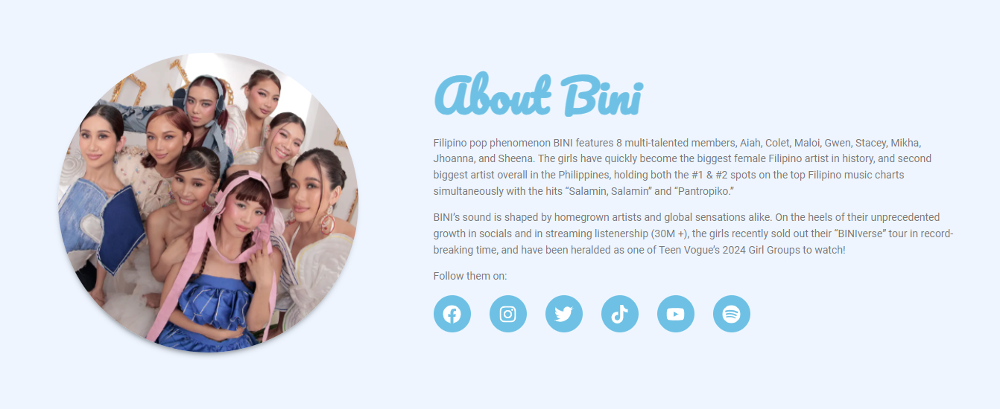

# BINI Fan Website

Welcome to the **BINI Fan Website**! This WordPress-powered site is dedicated to the popular Filipino girl group **BINI**. The site is designed using **Elementor** and enhanced with features from plugins like **Smart Slider** to provide an engaging and dynamic experience for fans.

## Website Features

### 1. About BINI
Learn more about the group’s background, their success, and how they’ve become one of the most popular girl groups in the Philippines. I also included their social media links.

### 2. Members
Each member has a dedicated section with the following details:
- **Full Name**
- **Nickname**
- **Birthday**
- **Special Talents**
- **Interests**
- **Favorite Motto**

### 3. Discography
The discography section features BINI's albums and music releases, each linked to official YouTube music videos.

### 4. Gallery
This section showcases **BINI’s Gallery**, including:
- **Individual member photos** highlighting their unique visuals.
- **Group photos** showing BINI together in official shoots.

## Technologies & Plugins Used
- **WordPress** – CMS for managing content
- **Elementor** – Drag-and-drop page builder for layout and design
- **Smart Slider** – Plugin for creating interactive sliders